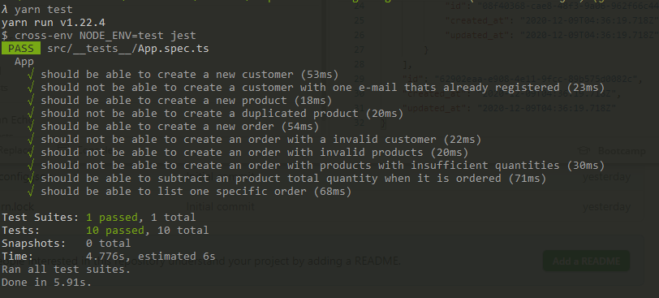

<p align="center">
  <a href="#rocket-tecnologias">Tecnologias</a>&nbsp;&nbsp;&nbsp;|&nbsp;&nbsp;&nbsp;
  <a href="#-projeto">Projeto</a>&nbsp;&nbsp;&nbsp;|&nbsp;&nbsp;&nbsp;
  <a href="#-como-rodar">Como rodar</a>&nbsp;&nbsp;&nbsp;|&nbsp;&nbsp;&nbsp;
  <a href="#-Rotas">Rotas</a>&nbsp;&nbsp;&nbsp;|&nbsp;&nbsp;&nbsp;
  <a href="#-como-contribuir">Como contribuir</a>&nbsp;&nbsp;&nbsp;
  </p>

<br>


## GoStack - Oitavo desafio NodeJs

## 🚀 Tecnologias

Esse projeto foi desenvolvido com as seguintes tecnologias:

- [NodeJS](https://nodejs.org/en/) - 0.63.3
- [Yarn](https://yarnpkg.com/) - 1.22.4
- [Npm](https://www.npmjs.com/) - 6.14.5
- [Docker](https://www.docker.com/) - 19.03.8


## 💻 Projeto

API que gravar Custom(cliente), Products(produtos), Order(compra) e OrderProducts(produtos na compra) e retorna as Orders.

Descrição do desafio [GoStack](https://github.com/rocketseat-education/bootcamp-gostack-desafios/tree/master/desafio-database-relations)


Resolulção do teste.
<p align="center">
  
</p>

## 👩🏿‍💻 Rotas

- **`POST /orders`**: Nessa rota você deve receber no corpo da requisição o customer_id e um array de products, contendo o id e a quantity que você deseja adicionar a um novo pedido. Aqui você deve cadastrar na tabela orders um novo pedido, que estará relacionado ao customer_id informado, created_at e updated_at . Já na tabela orders_products, você deve armazenar o product_id, order_id, price e quantity, created_at e updated_at.
Enviar:
```
{
    "costumer_id": "5ea2492c-c93f-4d48-93f1-1e871cee3149",
    "products": [
        {
            "id": "9cc91df5-cf30-47e9-894f-93e8712d820c",
            "quantity": 1
        },
        {
            "id": "e0096c7f-f66d-4786-a738-1611065ad169",
            "quantity": 5
        }
    ]
}
```
Retorna:
```
{
    "customer": {
        "id": "5ea2492c-c93f-4d48-93f1-1e871cee3149",
        "name": "João Mangueira",
        "email": "joao1@joao.com",
        "created_at": "2020-12-09T04:34:05.752Z",
        "updated_at": "2020-12-09T04:34:05.752Z"
    },
    "order_products": [
        {
            "product_id": "9cc91df5-cf30-47e9-894f-93e8712d820c",
            "price": "39.98",
            "quantity": 1,
            "order_id": "62902eaa-e908-4e11-9fcc-89b575d0082c",
            "id": "64b21779-69a4-4ae0-8684-696b1d0588d9",
            "created_at": "2020-12-09T04:36:19.718Z",
            "updated_at": "2020-12-09T04:36:19.718Z"
        },
        {
            "product_id": "e0096c7f-f66d-4786-a738-1611065ad169",
            "price": "39.98",
            "quantity": 5,
            "order_id": "62902eaa-e908-4e11-9fcc-89b575d0082c",
            "id": "08f40368-cae8-48f3-9a06-962f66c448c7",
            "created_at": "2020-12-09T04:36:19.718Z",
            "updated_at": "2020-12-09T04:36:19.718Z"
        }
    ],
    "id": "62902eaa-e908-4e11-9fcc-89b575d0082c",
    "created_at": "2020-12-09T04:36:19.718Z",
    "updated_at": "2020-12-09T04:36:19.718Z"
}
```
- **`POST /products`**: Essa rota deve receber name, price e quantity dentro do corpo da requisição, sendo o name o nome do produto a ser cadastrado, price o valor unitário e quantity a quantidade existente em estoque do produto. Com esses dados devem ser criados no banco de dados um novo produto com os seguintes campos: name, price, quantity, created_at, updated_at.
Enviar:
```
{
    "name": "Livro 1",
    "price": "39.98",
    "quantity": "10"
}
```
Retorna:
```
{
    "name": "Livro 1",
    "price": "39.98",
    "quantity": "10",
    "id": "e0096c7f-f66d-4786-a738-1611065ad169",
    "created_at": "2020-12-09T04:35:47.319Z",
    "updated_at": "2020-12-09T04:35:47.319Z"
}
```
- **`POST /customers`**: A rota deve receber name e email dentro do corpo da requisição, sendo o name o nome do cliente a ser cadastrado. Ao cadastrar um novo cliente, ele deve ser armazenado dentro do seu banco de dados e deve ser retornado o cliente criado. Ao cadastrar no banco de dados, na tabela customers deverá possuir os campos name, email, created_at, updated_at.
Enviar:
```
{
    "name": "João Mangueira",
    "email": "joao1@joao.com"
}
```
Retorna:
```
{
    "name": "João Mangueira",
    "email": "joao1@joao.com",
    "id": "5ea2492c-c93f-4d48-93f1-1e871cee3149",
    "created_at": "2020-12-09T04:34:05.752Z",
    "updated_at": "2020-12-09T04:34:05.752Z"
}
```
- **`GET /orders/:id`**: Essa rota deve retornar as informações de um pedido específico, com todas as informações que podem ser recuperadas através dos relacionamentos entre a tabela orders, customers e orders_products.
Retorna:
```
{
    "id": "d3260138-51b1-4b13-a081-2bfeea3f2141",
    "created_at": "2020-12-09T04:34:32.633Z",
    "updated_at": "2020-12-09T04:34:32.633Z",
    "order_products": [
        {
            "id": "edc5b403-9d52-4359-bdc6-36cb74c7fc01",
            "product_id": "9cc91df5-cf30-47e9-894f-93e8712d820c",
            "order_id": "d3260138-51b1-4b13-a081-2bfeea3f2141",
            "price": "39.98",
            "quantity": 1,
            "created_at": "2020-12-09T04:34:32.633Z",
            "updated_at": "2020-12-09T04:34:32.633Z"
        }
    ],
    "customer": {
        "id": "5ea2492c-c93f-4d48-93f1-1e871cee3149",
        "name": "João Mangueira",
        "email": "joao1@joao.com",
        "created_at": "2020-12-09T04:34:05.752Z",
        "updated_at": "2020-12-09T04:34:05.752Z"
    }
}
```

## 🚀 Como Rodar

- Clone o projeto.
- Entre na pasta do projeto e rode yarn install (pode usar npm install de acordo com a sua configuração).
- Rode o comando docker run --name gostack_postgres -e POSTGRES_PASSWORD=docker -p 5432:5432 -d postgres
- Crei os bancos gostack_desafio09 e gostack_desafio09_tests.
- λ yarn typeorm migration:run
- yarn test para rodar os testes.
- yarn yarn dev:server para rodar o projeto (localhost:3333).

## 🤔 Como contribuir

- Faça um fork desse repositório;
- Cria uma branch com a sua feature: `git checkout -b minha-feature`;
- Faça commit das suas alterações: `git commit -m 'feat: Minha nova feature'`;
- Faça push para a sua branch: `git push origin minha-feature`.

Depois que o merge da sua pull request for feito, você pode deletar a sua branch.

## 📝 Licença

Esse projeto está sob a licença MIT.
